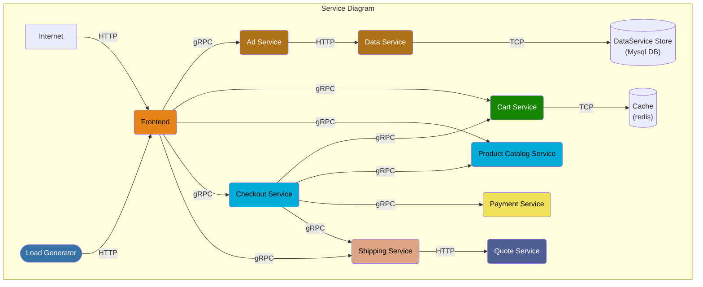
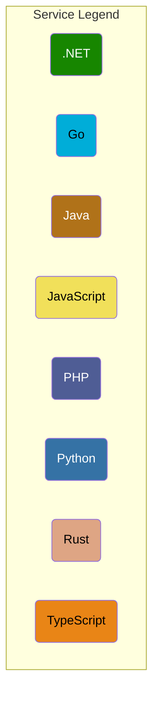

# OpenTelemetry Demo Helm Chart

This chart is an extension of official [OpenTelemetry Demo](https://github.com/open-telemetry/opentelemetry-demo) and 
official [OpenTelemetry Demo Chart](https://github.com/open-telemetry/opentelemetry-helm-charts/tree/main/charts/opentelemetry-demo)


# Demo Architecture




# Set up

```shell
helm repo add open-insight https://openinsight-proj.github.io/openinsight-helm-charts

helm install webstore-demo-lite open-insight/opentelemetry-demo-lite -n webstore-demo --create-namespace
```

# demo-UI

we have a NodePort type svc named webstore-ui, find it and enjoy the webstore demo

# reimplement components

- [adservice](https://github.com/openinsight-proj/opentelemetry-demo/tree/daocloud/src/adservice-v2#adservice-springcloud)
- [checkoutservice](https://github.com/openinsight-proj/opentelemetry-demo/tree/daocloud/src/checkoutservice-v2#checkout-service)

# support switch redis instance

we use build-in redis by default, if you want to use a redis create by redis-operation(we use
[openebs](https://openebs.io/) as PersistentVolume, if you want to use others: `--set redis_resource.storageClassName=your-PersistentVolume` ),
your need: `--set redis_operator.enabled=true --set redis_resource.enabled=true`

# note 

## service listed bellow are disable by default
- adservice
- dataservice
- mysql
